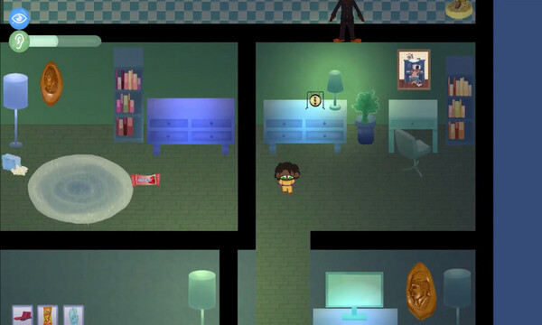
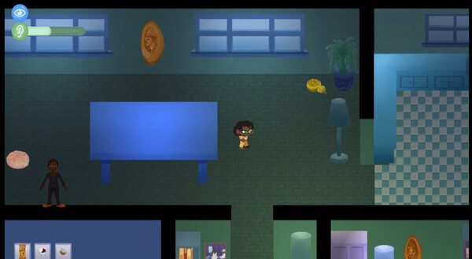
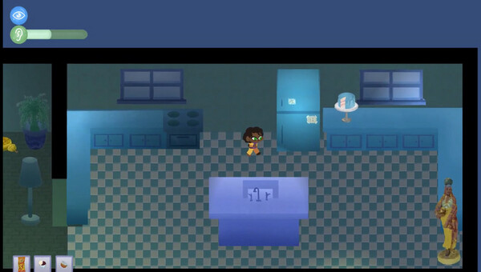

# Late Night Snackin' 🎂

*Late Night Snackin' is a 2D snack-stealth game inspired by the fun anxiety of hide and go seek.*

*Created over the course of summer 2021, Late Night Snackin' is a project produced by <a href="https://gameheadsoakland.org/" target="_blank">Gameheads</a> students. While Adaya was one of 3 programmers, her contributions to this project included: the game’s scene management controller, player controller, power-up ability, item inventory, item collection, and UI systems. The game's demo released as planned in the following fall, in December 2021. **Play the demo on <a href="https://gameheads.itch.io/late-night-snackin" target="_blank">itch.io</a>.*** 

## Code Samples🍰
- <a href="https://github.com/dayahh/LNS-codeEx/blob/main/PlayerController" target="_blank">Player Controller</a>
- 🚧Item Inventory
- 🚧Item Collection
- 🚧UI Sound Bar

## Gameplay 🍰
 

## In-Game Screenshots 🍰
   

